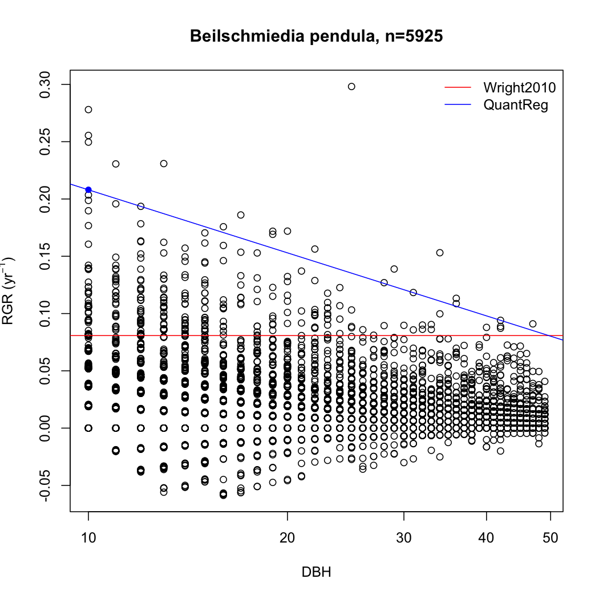

% Growth trajectories: untangling the link between leaf traits and plant growth
% Daniel Falster; Rich FitzJohn (model); Joe Wright (data)
% 2014.04.08

# Finally writing a paper about growth rates

* Expand on theory about link between traits and growth
	- widespread disconnect between theory and data
	- model I published in 2011 actually clarifies a lot of empirical results, but did not emphasises this
	- number of projects about growth rate

* Fresh analysis of BCI data

# Analysis of BCI data

Wright et al. 2010 -

- link to traits is clearest when analyse *potential growth rate* rather than *mean growth rate*
- but link with LMA still weak (r2=0.17 in saplings, NS in trees)
- questioned worth of LMA as trait

## New approach for calculating potential growth rate

Based on fitting quantile regression

Example for small trees

Also for small trees

Comparing old vs new methods

# Correlation with traits
In saplings

In small trees

# Theory to explain data

## Production

Begin with a standard model for the amount of biomass production available for growth:

$$\frac{dP}{\textrm{d}t}= \underbrace{\strut Y}_\textrm{yield} \big(\underbrace{\strut \frac{m_\textrm{l}}{\phi} \, A}_\textrm{photosynthesis} - \big(\underbrace{\strut \, \frac{m_\textrm{l}}{\phi} \, r_\textrm{l} + \sum_\textrm{i=b,s,r}{m_\textrm{i} \, r_\textrm{i}}}_\textrm{respiration}\big)\big) - \big(\underbrace{\strut \sum_\textrm{i=l,b,s,r}{m_\textrm{i} \, k_\textrm{i}}}_\textrm{turnover}\big).$$

- $\phi$ = leaf construction costs (aka. leaf mass per area)
- $m,r$, and $k$ = mass, respiration rate, and turnover rate
- subscripts: $l$=leaves, $b$=bark, $s$=sapwood and $r$=roots
- $A$ = assimilation rate per leaf area
- $Y$ is yield, which accounts for growth respiration

## Classic model for relative growth rate

Iff we ignore: all turnover terms, respiration terms for non-leaf tissues, + reproduction

$$\Rightarrow \frac{dP}{\textrm{d}t} \approx \frac{m_\textrm{l}}{\phi} \, A_\textrm{net}$$

where $A_\textrm{net} = Y(A - r_\textrm{l})$.

Then,
$$R_{m_\textrm{t}}= \frac{1}{m_\textrm{t}} \, \frac{\textrm{d}P}{\textrm{d}t}  \approx A_\textrm{net} \times \phi^{-1} \times \frac{m_\textrm{l}}{m_\textrm{t}}.$$

But

- does not match data: correlation with $\phi$ absent in large plants
- cannot ignore terms for larger plants (production not linear with leaf area)
- diameter and height growth $\neq$ mass growth

# Extended model - height growth

$$\frac{\textrm{d}h}{\textrm{d}t}= \underbrace{\strut\frac{\textrm{d}h}{\textrm{d}a_\textrm{l}}}_\textrm{architecture}
\times \underbrace{\strut\frac{\textrm{d}a_\textrm{l}}{\textrm{d}m_\textrm{t}}}_\textrm{leaf deployment rate}
\times \underbrace{\strut\frac{\textrm{d}m_\textrm{t}}{\textrm{d}P}}_\textrm{allocation to growth}
\times \underbrace{\strut\frac{\textrm{d}P}{\textrm{d}t}}_\textrm{mass production}$$

$$\frac{\textrm{d}a_\textrm{l}}{\textrm{d}m_\textrm{t}}
= \big(\phi
 + \frac{\textrm{d}m_\textrm{s}}{\textrm{d}a_\textrm{l}} + \frac{\textrm{d}m_\textrm{b}}{\textrm{d}a_\textrm{l}} + \frac{\textrm{d}m_\textrm{r}}{\textrm{d}a_\textrm{l}}\big)^{-1}.$$

## Basal area growth

$$ \frac{\textrm{d}a_\textrm{st}}{ \textrm{d}t}= \underbrace{\strut \frac{\textrm{d}a_\textrm{ss}} { \textrm{d}t} + \frac{\textrm{d}a_\textrm{b}}{\textrm{d}t}}_\textrm{expanding live bark and sapwood} + \underbrace{\strut\frac{\textrm{d}a_\textrm{sh}}{\textrm{d}t}}_\textrm{heartwood formation}$$

## Diameter growth

$$\frac{\textrm{d}D}{\textrm{d}t}= \sqrt{\frac{\pi}{a_\textrm{st}}} \frac{\textrm{d}a_\textrm{st}}{\textrm{d}t}.$$

Are mathematically true and must therefore hold for any model of plant growth.

# Also need an allometric  model for size

1. An allometric relation between total leaf area and plant height
2. A constant ratio between total leaf area and each of sapwood cross-sectional area, bark cross-sectional area, and total root mass.

Reasonable support from data (good first approximation)

# Specify influence of leaf construction cost

$$\frac{dP}{\textrm{d}t}= \underbrace{\strut Y}_\textrm{yield} \big(\underbrace{\strut \frac{m_\textrm{l}}{\phi} \, A}_\textrm{photosynthesis} - \big(\underbrace{\strut \, \frac{m_\textrm{l}}{\phi} \, r_\textrm{l} + \sum_\textrm{i=b,s,r}{m_\textrm{i} \, r_\textrm{i}}}_\textrm{respiration}\big)\big) - \big(\underbrace{\strut \sum_\textrm{i=l,b,s,r}{m_\textrm{i} \, k_\textrm{i}}}_\textrm{turnover}\big).$$

Across species, leaf mass per area is inversely related to leaf turnover rate. Data from Wright et al  2004 for 678 species from 51 sites. Green lines show standardised major axis lines fitted to data from each site, with intensity of shading adjusted according to strength of the relationship.

# BCI DATA  - correlation of growth rate with LMA changes with size

Fresh analysis of BCI data. Potential growth rate calculated using quantile regression.

# Correlation of growth rate with LMA changes with size (model)

## Why?

Height growth is product of 4 size -dependent curves

Differential effects of LMA on $\frac{dP}{dt}$ and $\frac{dA}{dMt}$

# Other predictions - Sensitivity of growth to light

# Shade-tolerance

- Low LMA species less shade tolerant (always)
- decreases with size. (As previously recognised by Givnish)
- Faster decline in shade tolerance with size for low LMA species ??
- more than just shade - any prolonged period of low productivity. e.g. low LMA on less productive soils

# Ontogenetic shift towards higher LMA with size.

LMA maximising growth rate against size for different light environments

# Next steps

* Size dependence of growth
* Test other predictions with data fro seedlings from BCI
* Tests for other traits
